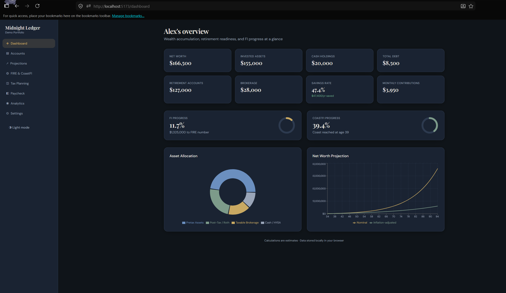

# Midnight Ledger

A modern personal finance dashboard for tracking net worth, FIRE progress, CoastFI, Monte Carlo projections, tax planning, and paycheck analysis. All data stays in your browser.

## Quick start

```bash
npm install
npm run dev
```

Open **http://localhost:5173**

## Features

### Dashboard
- Net worth, invested assets, cash, retirement, brokerage, debt
- Savings rate, FI progress, CoastFI progress
- Asset allocation pie chart (customizable categories)
- Net worth projection chart

### Accounts
- Unlimited accounts with balance, contributions, returns, tax treatment
- 401(k), Roth IRA, HSA, brokerage, HYSA, real estate, crypto, debts, custom
- React Hook Form + Zod validation
- CSV import/export

### Projections
- Monte Carlo fan chart (median, best/worst case)
- Nominal and inflation-adjusted views
- Adjustable assumptions (returns, volatility, inflation, growth)

### FIRE & CoastFI
- FIRE number, progress, gap, years until FI
- Withdrawal calculator (3%, 3.5%, 4%, custom)
- CoastFI timeline chart
- Success probability estimate
- Contribution impact analysis

### Tax Planning
- Retirement withdrawal tax simulator
- Federal brackets (2024), state tax (flat estimate)
- LTCG, Roth/traditional/brokerage withdrawals
- Tax bracket chart, income waterfall, Sankey flow

### Paycheck Calculator
- Gross-to-net with 401(k), Roth, HSA, ESPP, insurance
- Weekly, biweekly, semi-monthly, monthly
- Paycheck breakdown chart

### Advanced Analytics
- Stress testing (crash, inflation, spending, savings)
- Sequence of returns risk
- Fee impact calculator
- Roth vs Traditional analyzer
- RMD estimator
- Roth conversion planner

### Data
- Multiple scenarios
- JSON + CSV export/import
- localStorage persistence
- Optional Supabase backend hook (`localBackend` in store)

## Screenshots

### clipboard-1781812175155-0


## Architecture

```
src/
  engine/          # Centralized financial calculations (testable)
    accounts.ts    # Aggregations, allocation, CSV
    fire.ts        # FIRE, CoastFI, withdrawal
    projections.ts # Monte Carlo, deterministic projections
    tax.ts         # Federal/state tax, RMD, Roth analysis
    paycheck.ts    # Paycheck breakdown
    analytics.ts   # Stress tests, fee impact, sequence risk
  store/           # Zustand + persist
  pages/           # Route-level views
  components/      # Layout, charts (Recharts), shared UI
  schemas/         # Zod validation
```

## Tech stack

- Vite + React 18 + TypeScript
- Tailwind CSS
- Zustand (persisted state)
- Recharts
- React Hook Form + Zod
- Framer Motion
- React Router

## Build

```bash
npm run build
npm run preview
```

## Notes

Tax and projection calculations are **planning estimates**, not professional tax advice. Federal brackets use 2024 IRS tables; state taxes use simplified flat rates.

## Reset data

Settings → Reset all data, or delete `midnight-ledger-v2` from localStorage.
